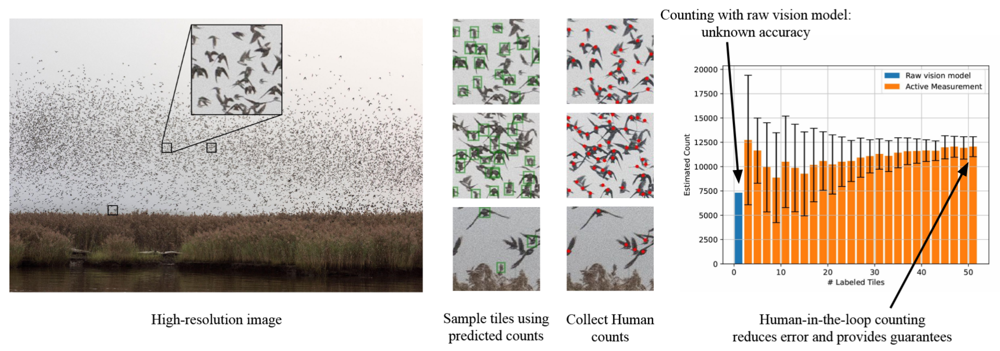

# Active Measurement: Efficient Estimation at Scale 📏- NeurIPS 2025

This repository contains the official implementation of **Active Measurement**, along with example datasets to reproduce the results from our NeurIPS paper:
[Active Measurement: Efficient Estimation at Scale](https://arxiv.org/abs/2507.01372)


## 📖 Overview

AI has the potential to transform scientific discovery by analyzing vast datasets with little human effort. However, current workflows often do not provide the accuracy or statistical guarantees that are needed. We introduce active measurement, a human-in-the-loop AI framework for scientific measurement. An AI model is used to predict measurements for individual units, which are then sampled for human labeling using importance sampling. With each new set of human labels, the AI model is improved and an unbiased Monte Carlo estimate of the total measurement is refined. Active measurement can provide precise estimates even with an imperfect AI model, and requires little human effort when the AI model is very accurate.


<sup>An AI model predicts counts for each image tile, which are then used
to form a proposal distribution to selectively sample tiles for human labeling. Ground-truth counts
are used both to improve the AI model and produce a Monte Carlo estimate of the final measurement<sup>

This repository includes:

- ✅ Implementations of Active Measurement algorithms  
- ✅ Precomputed predictions and ground-truth labels (for reproducibility)  
- ✅ An end-to-end pipeline for custom datasets and detectors  


## 🔧 Installation (for reproducing results)

Only basic Python packages are required:

```bash
pip install numpy pandas click
```

For full end-to-end training dependencies are listed in `requirements.txt`.


## 📁 Repository Structure

```
├── data/
│   ├── DSC5214_data.csv    # Annotations and detections on the sky image
│   ├── DSC5295_data2.csv   # Annotations and detections on the reeds image
│   ├── roost_counts/       # Annotations and detections for the radar station data
│
├── src/
│   ├── dataset_utils/      # Helper functions and config for detector finetuning
│   ├── estimator/          # Implementation of active measurement
│   ├── model/              # Classes for the measurement tasks
│   ├── run/                # Code to run for the measurement tasks
```


## 🔁 Reproducing Our Results

All experiment scripts are located in `src/run/`. Since predictions and ground-truth labels are already included in the `data/` directory, **no detector training is required** to reproduce the main results.

### Sky image

Run Active Importance Sampling (AIS):

```commandline
python -m run.run_image --path ../data/DSC5214_data.csv --var_weighting uniform
```

With **sampling without replacement (SWOR)**:

```commandline
python -m run.run_image --path ../data/DSC5214_data.csv --swor --var_weighting LURE
```

Using **conditional variances** instead of simple variance:

```commandline
python -m run.run_image --path ../data/DSC5214_data.csv --swor --cond --var_weighting LURE
```


### Reeds image

Replace the path with:

```
../data/DSC5295_data2.csv
```

The rest of the command structure is identical.


### Radar station counting
The commands for the radar counting tasks are similar. For the KBUF station, run

```commandline
python -m run.run_station --station KBUF --var_weighting LURE
```

The arguments `--swor` and `--cond` behave the same way as with image tasks.


## 🚀 Running on a Custom Dataset (End-to-End)

This repository includes support for full end-to-end training with your own dataset and detector.

1. Open the `DetectorCounting` class in `src/detector_counting.py`
2. Modify the `train` method to:
   - Finetune your model on the currently sampled data
   - Update predictions over the full dataset
3. Optionally update `__init__` to support your dataset loading

Skeleton:

```python
def train(self, mask=None):
    if self.t < self.max_round - 1:
        self.t += 1
        data = [self.dataset[x] for x in np.where(mask)[0]]
        if len(data) == 0:
            return

        # Finetune model
        [Your training code here]

        # Update predictions
        [Your inference code here]
        self.g = np.array(g)
```

Once implemented, run the full pipeline with:

```commandline
python -m run.run_pipeline --path /path/to/your/data --swor --var_weighting LURE
```


## 💻 Hardware Notes

- CPU is sufficient for reproducing the paper’s results
- GPU will be used automatically (if available) for end-to-end training


## 📚 Citation

If you use this work, please cite:

```bibtex
@misc{hamilton2025activemeasurementefficientestimation,
  title        = {Active Measurement: Efficient Estimation at Scale},
  author       = {Max Hamilton and Jinlin Lai and Wenlong Zhao and Subhransu Maji and Daniel Sheldon},
  year         = {2025},
  eprint       = {2507.01372},
  archivePrefix= {arXiv},
  primaryClass = {cs.CV},
  url          = {https://arxiv.org/abs/2507.01372}
}
```